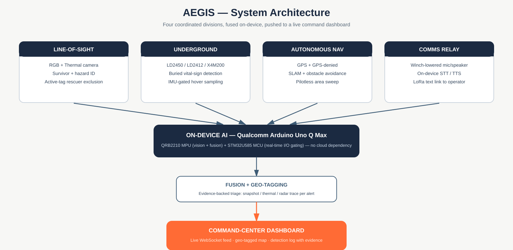
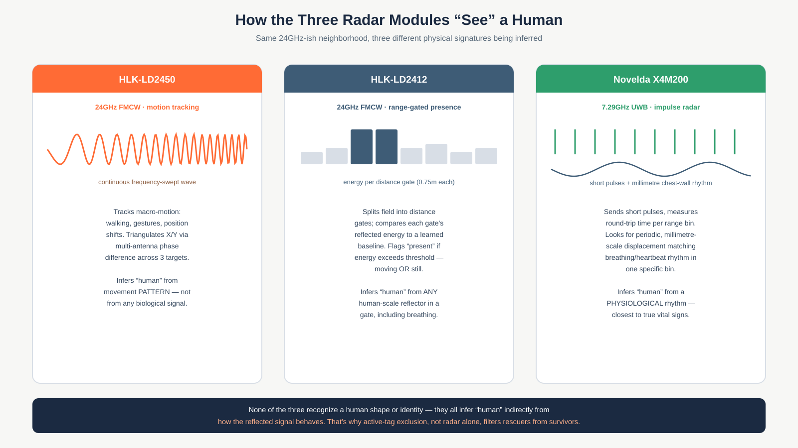
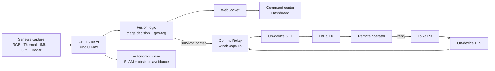
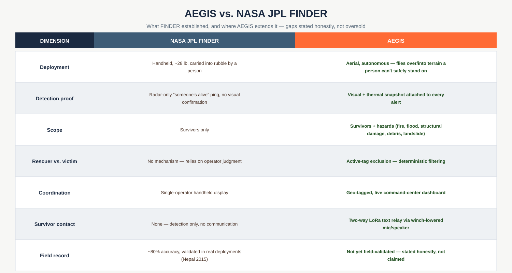

# AEGIS
### AI-powered autonomous drone for search & rescue
**Team Impact Minds** · Smart India Hackathon 2026 · Problem Statement **SIH26177** (Qualcomm Inc. · Robotics and Drones · Hardware)

> *"A deployable AI-powered autonomous drone that aids search-and-rescue operations by detecting people and hazards, thereby improving responder safety and reducing victim discovery time."*

---

## Table of Contents
- [The Problem](#the-problem)
- [What NASA JPL's FINDER Lacked](#what-nasa-jpls-finder-lacked)
- [System Architecture](#system-architecture)
- [How Each Sensor Works](#how-each-sensor-works)
- [Data Pipeline](#data-pipeline)
- [AEGIS vs. FINDER](#aegis-vs-finder)
- [Hardware](#hardware)
- [Software Stack](#software-stack)
- [Project Status](#project-status)
- [References](#references)

---

## The Problem

In the first hours after a disaster — an earthquake, a building collapse, a flood — two things are scarce: **time** and **safe access**. Search-and-rescue (SAR) teams have to manually search unstable rubble, often without knowing what hazards (fire, structural failure, floodwater) are hiding nearby, and without any way to know whether a buried survivor is alive before digging.

Existing tools solve pieces of this, but not the whole picture:
- Trained dogs and handheld life-detectors require a person to physically enter the danger zone.
- Thermal drones can spot people on the surface, but can't see anyone buried.
- Radar life-detectors can sense someone under rubble, but can't show responders *what* triggered the alert, or tell a rescuer from a victim.

AEGIS is built to close that gap: one autonomous aerial platform that finds survivors on the surface **and** underground, flags hazards, filters out its own rescue team, and lets responders act on evidence instead of a guess.

---

## What NASA JPL's FINDER Lacked

[FINDER](https://www.jpl.nasa.gov/) (Finding Individuals for Disaster and Emergency Response) is the benchmark in this space — a handheld radar, built on JPL's spacecraft-tracking signal processing, that detects breathing/heartbeat motion through rubble. It's real, it's been field-validated (helped locate survivors after the 2015 Nepal earthquake), and AEGIS is directly inspired by it.

But FINDER has structural limitations that come from *what it is* — a handheld, single-purpose radar:

- **No visual proof.** It gives a "someone is alive somewhere in this field" signal — it can't show a responder what it found.
- **Requires a person to carry it into the danger zone.** The exact terrain FINDER is searching (unstable rubble) is the terrain a responder has to physically stand on to use it.
- **Survivors only.** It has no way to flag fire, floodwater, or structural hazards nearby.
- **No way to tell rescuer from victim.** If a team member walks through the search field, FINDER can't filter them out.
- **No communication.** Once someone is found, FINDER's job is done — it can't help a located-but-not-yet-extracted survivor communicate with responders (a real gap seen in Nepal 2015, where found survivors sometimes waited hours for extraction).

AEGIS doesn't replace FINDER's radar science — it inherits the same physical principle (detecting breathing-scale motion) but removes the handheld/single-purpose constraints by putting it on an autonomous drone alongside vision, hazard detection, and two-way comms.

---

## System Architecture

AEGIS runs four coordinated divisions, fused on-device and pushed live to a command-center dashboard:

- **Line-of-Sight** — RGB + thermal camera detect visible survivors and classify hazards (fire, floodwater, structural damage, debris, landslide zones). An active-tag system deterministically excludes tagged rescue-team members from being flagged.
- **Underground** — Radar detects buried survivors' vital signs through rubble, the same core capability as FINDER, but aerial and IMU-gated instead of handheld and manually operated.
- **Autonomous Navigation** — GPS and GPS-denied navigation with obstacle avoidance lets the drone sweep a disaster zone without a pilot.
- **Comms Relay** — A winch-lowered mic/speaker capsule, on-device speech-to-text/text-to-speech, and a LoRa text link let a located survivor exchange messages with a remote operator — fully offline.

All AI inference (vision, classification, fusion) runs on a **Qualcomm Arduino Uno Q Max** (QRB2210 MPU + STM32U585 MCU) — no cloud dependency, which matters when disaster zones typically have no cellular or Wi-Fi infrastructure at all.

> **Compute branch (if budget allows):** Qualcomm's newer **Arduino Ventuno Q** (Dragonwing IQ-8275, 40 TOPS NPU, 16GB RAM, tri-band Wi-Fi 6/6GHz, native ROS 2) is being evaluated as an upgrade path on a separate branch. It isn't the committed baseline — the Uno Q Max remains the primary target — but it would meaningfully de-risk the hazard-classification and autonomous-nav workloads if it fits the budget. See [Hardware](#hardware) for the comparison.

---

## How Each Sensor Works

The Underground division uses three different radar modules, and they don't detect "a human" the same way — each infers a human presence from a different physical signature:

- **HLK-LD2450** (24GHz FMCW) tracks up to 3 targets by **macro-motion** — walking, gestures, position shifts — triangulating X/Y position via multi-antenna phase difference. It's good at open-air human tracking, but its 24GHz wavelength attenuates fast through dense rubble, so it can't penetrate meaningful debris depth.
- **HLK-LD2412** (24GHz FMCW, range-gated) divides its field into 0.75m distance gates and compares each gate's reflected energy against a learned baseline — flagging "present" whether the person is moving or lying still and breathing. This is what lets it catch someone motionless where LD2450 would miss them.
- **Novelda X4M200** (7.29GHz UWB impulse radar) sends short pulses and looks for millimeter-scale, periodic displacement in a specific range bin matching a breathing/heartbeat rhythm — the closest of the three to genuine vital-sign extraction, and (with a wider bandwidth than the 24GHz modules) capable of real through-wall/through-debris penetration where the LD-series can't go.

None of the three recognize a human shape or identity biologically — they all infer "human" indirectly from how the reflected signal behaves. That's precisely why **active-tag exclusion**, not the radar itself, is what filters a rescuer from a survivor in AEGIS's design.

The LOS division's RGB + thermal cameras work differently: RGB does shape-based person detection, and thermal cross-checks that detection against a live-body heat signature to filter out false shapes (mannequins, reflections, etc.) that RGB alone might flag.

---

## Data Pipeline

---

## AEGIS vs. FINDER

One thing worth being upfront about: FINDER's ~80% field accuracy comes from real deployments, including Nepal 2015. AEGIS doesn't have equivalent field-trial data yet — we're not claiming a numeric accuracy improvement over FINDER, only a set of mechanism differences (evidence-backed alerts, hazard scope, rescuer filtering, autonomy, and survivor comms) that are independently verifiable from the design itself.

---

## Hardware

| Component | Role | Status |
|---|---|---|
| S500 quadcopter | Airframe | Have |
| Qualcomm Arduino Uno Q (Max) | On-device AI — QRB2210 MPU + STM32U585 MCU | Have |
| STM32F411VE | Sensor-node MCU | Have |
| ESP32 / ESP32-S3 | Sensor nodes, WebSocket comms | Have |
| HLK-LD2450 | 24GHz radar, open-air human tracking | Have |
| HLK-LD2412 | Breathing/presence radar | Have |
| Novelda X4M200 | UWB radar, true rubble penetration | **Mandatory — not yet purchased** (India sourcing in progress) |
| Thermal camera (Lepton 3.5 / InfiRay CLIP-M) | Imaging thermal for LOS division | **Mandatory** (per judge feedback — no longer optional) |
| Arduino Ventuno Q (Dragonwing IQ-8275) | Compute upgrade — 40 TOPS NPU, 16GB RAM, tri-band Wi-Fi 6, native ROS 2 | **Branch/if budget allows** — not the committed baseline, evaluating as an upgrade over Uno Q Max |
| RGB camera | LOS visual detection | To confirm in BOM |
| INMP441 | Microphone | Have |
| LoRa module (SX1276/RFM95-class) | Comms relay long-range link | To source |
| Servo + winch/tether | Lowers comms capsule | To build |

---

## Software Stack

- **On-device AI**: lightweight vision/classification models on the Uno Q (QRB2210 has GPU/VPU/ISP, no dedicated NPU — models kept nano/tiny-class)
- **Firmware**: ESP32 / STM32 for sensor nodes
- **Comms relay**: Vosk (offline STT), espeak-ng (offline TTS), LoRa text transport
- **Dashboard**: WebSocket-fed command-center interface, Chart.js v4, geo-tagged detection log
- **Simulator**: Python isometric simulator for hardware-free testing

---

## Project Status

**Built:** ESP32 firmware · Python simulator · command dashboard · SIH idea submission documents

**In progress / open:**
1. Autonomous navigation (waypoint + obstacle avoidance first, SLAM later)
2. Hazard classification model (fire / smoke / floodwater / structural damage)
3. LOS + radar + IMU fusion logic, active-tag exclusion
4. Comms relay subsystem (winch, STT/TTS pipeline, LoRa integration)
5. X4M200 sourcing — **mandatory**, institutional import route or vendor sample request
6. Thermal camera acquisition — **mandatory per judge feedback**, no longer treated as optional
7. Bench/field testing — real measured range & accuracy numbers per sensor, replacing vendor spec sheets
8. *(branch, if budget allows)* Evaluate migrating primary compute from Uno Q Max to Arduino Ventuno Q

---

## References

1. NASA JPL — FINDER (Finding Individuals for Disaster and Emergency Response) program documentation and Nepal 2015 field results
2. Accurate sensing of multiple humans buried under rubble using IR-UWB SISO radar during search and rescue — ScienceDirect, 2022
3. Ultra-Wideband Impulse Radar Through-Wall Detection of Vital Signs — Nature Scientific Reports, 2018
4. Automatic Life Detection Based on Efficient Features of Ground-Penetrating Rescue Radar Signals — PMC, 2023
5. Human Respiration and Motion Detection Based on Deep Learning and Signal Processing Techniques to Support Search and Rescue Teams — MDPI, 2025
6. Non-Contact Breathing Monitoring Using SBDA Based on UWB Radar Sensors (X4M200-based study) — PMC, 2022
7. Optimized 2D CA-CFAR for Drone-Mounted Radar Signal Processing Using Integral Image Algorithm — arXiv:2012.11077

---

*Built by Team Impact Minds for Smart India Hackathon 2026.*
